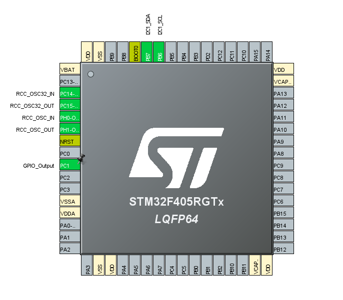
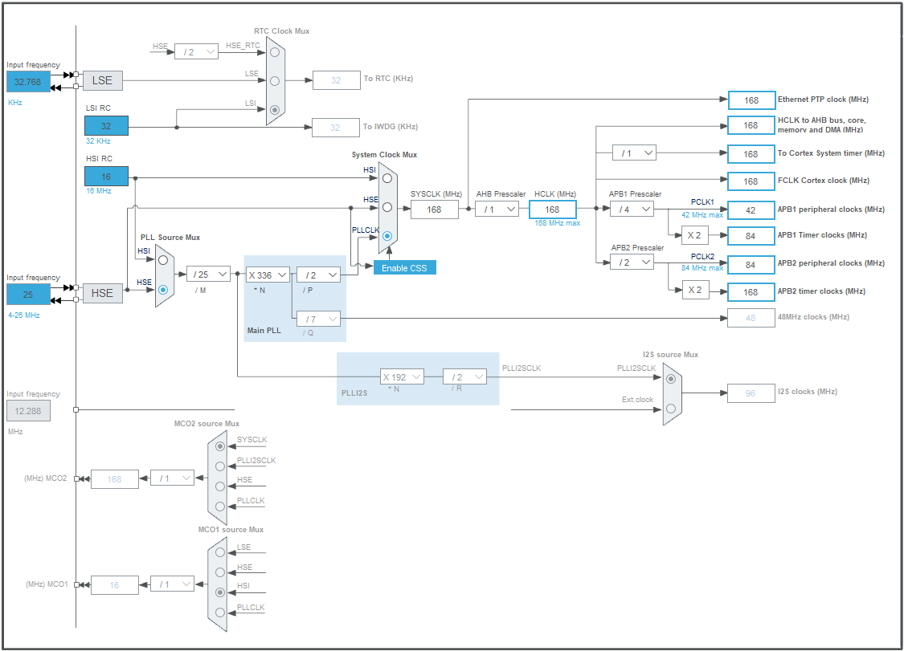
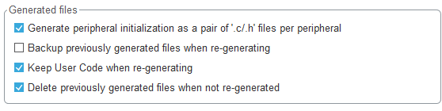

# STM32 CubeMX Tutorial by Chengming Zhang

PLEASE DO NOT SHARE OUTSIDE OF THE CLUB

## GPIO

### GPIO Initialization

```c
void HAL_GPIO_Init(GPIO_TypeDef  *GPIOx, GPIO_InitTypeDef *GPIO_Init)

//usually generated by cubemx, you dont need to manually types these
static void MX_GPIO_Init(void)
{
  GPIO_InitTypeDef GPIO_InitStruct = {0};

  /* GPIO Ports Clock Enable */
  __HAL_RCC_GPIOC_CLK_ENABLE();

  /*Configure GPIO pin Output Level */
  HAL_GPIO_WritePin(GPIOC, GPIO_PIN_1, GPIO_PIN_RESET);

  /*Configure GPIO pin : PC1 */
  GPIO_InitStruct.Pin = GPIO_PIN_1;
  GPIO_InitStruct.Mode = GPIO_MODE_OUTPUT_PP;
  GPIO_InitStruct.Pull = GPIO_NOPULL;
  GPIO_InitStruct.Speed = GPIO_SPEED_FREQ_LOW;
  HAL_GPIO_Init(GPIOC, &GPIO_InitStruct);

}
```


### GPIO Write Pins

```c
void HAL_GPIO_WritePin(GPIO_TypeDef* GPIOx, uint16_t GPIO_Pin, GPIO_PinState PinState);

//usage as follow
HAL_GPIO_WritePin(GPIOC, GPIO_PIN_1, GPIO_PIN_SET); // turn on PC1 to HIGH

// Pin State defination
typedef enum
{
  GPIO_PIN_RESET = 0, //off
  GPIO_PIN_SET //on
}GPIO_PinState;
```


### GPIO De-Initialization

```c
/**
  * @brief  De-initializes the GPIOx peripheral registers to their default reset values.
  * @param  GPIOx where x can be (A..K) to select the GPIO peripheral for STM32F429X device or
  *                      x can be (A..I) to select the GPIO peripheral for STM32F40XX and STM32F427X devices.
  * @param  GPIO_Pin specifies the port bit to be written.
  *          This parameter can be one of GPIO_PIN_x where x can be (0..15).
  * @retval None
  */
void HAL_GPIO_DeInit(GPIO_TypeDef  *GPIOx, uint32_t GPIO_Pin)
```


### GPIO Read Pin Value

```c
/**
  * @brief  Reads the specified input port pin.
  * @param  GPIOx where x can be (A..K) to select the GPIO peripheral for STM32F429X device or
  *                      x can be (A..I) to select the GPIO peripheral for STM32F40XX and STM32F427X devices.
  * @param  GPIO_Pin specifies the port bit to read.
  *         This parameter can be GPIO_PIN_x where x can be (0..15).
  * @retval The input port pin value.
  */
GPIO_PinState HAL_GPIO_ReadPin(GPIO_TypeDef* GPIOx, uint16_t GPIO_Pin)
```


### GPIO Toggle Pins

```c
/**
  * @brief  Toggles the specified GPIO pins.
  * @param  GPIOx Where x can be (A..K) to select the GPIO peripheral for STM32F429X device or
  *                      x can be (A..I) to select the GPIO peripheral for STM32F40XX and STM32F427X devices.
  * @param  GPIO_Pin Specifies the pins to be toggled.
  * @retval None
  */
void HAL_GPIO_TogglePin(GPIO_TypeDef* GPIOx, uint16_t GPIO_Pin)
```


### GPIO EXIT IQR

```c
/**
  * @brief  This function handles EXTI interrupt request.
  * @param  GPIO_Pin Specifies the pins connected EXTI line
  * @retval None
  */
void HAL_GPIO_EXTI_IRQHandler(uint16_t GPIO_Pin)
```


## I2C

### CubeMX Setup



In the system Core menu, turn on the RCC clock for HSE and LSE by select the **Crystal/Ceramic Resonator**.

In the Connectivity menu, turn on the I2C by select the I2C Mode. Verify the pin that is activated is the same as the one that was designed for in the original EAGLE file from your board manufacture.

Now go to clock frequency, verify that the HCLK is at the MAX indicated in the blue text. In my case, my clock configuration is like the following. 



Now open the Project Manager tab -> Code Generator and turn on the **Generate peripheral initialization as a pair of  '.c/.h' files per peripheral**



Now click the **Device Configuration Generation Tool** Button to generate the code

### I2C Read

```c
/**
  * @brief  Read an amount of data in blocking mode from a specific memory address
  * @param  hi2c Pointer to a I2C_HandleTypeDef structure that contains
  *                the configuration information for the specified I2C.
  * @param  DevAddress Target device address: The device 7 bits address value
  *         in datasheet must be shifted to the left before calling the interface
  * @param  MemAddress Internal memory address
  * @param  MemAddSize Size of internal memory address
  * @param  pData Pointer to data buffer
  * @param  Size Amount of data to be sent
  * @param  Timeout Timeout duration
  * @retval HAL status
  */

//Please remember to left shit one bit for the I2C Addr
HAL_StatusTypeDef HAL_I2C_Mem_Read(I2C_HandleTypeDef *hi2c, uint16_t DevAddress, uint16_t MemAddress, uint16_t MemAddSize, uint8_t *pData, uint16_t Size, uint32_t Timeout)

//usage:
i2cStats = HAL_I2C_Mem_Read(&hi2c1, LSM6DS33_DEV_ADD << 1, 0x20, I2C_MEMADD_SIZE_8BIT, temperatureData, 2, 100); 
```


### I2C Write

```c
/**
  * @brief  Write an amount of data in blocking mode to a specific memory address
  * @param  hi2c Pointer to a I2C_HandleTypeDef structure that contains
  *                the configuration information for the specified I2C.
  * @param  DevAddress Target device address: The device 7 bits address value
  *         in datasheet must be shifted to the left before calling the interface
  * @param  MemAddress Internal memory address
  * @param  MemAddSize Size of internal memory address
  * @param  pData Pointer to data buffer
  * @param  Size Amount of data to be sent
  * @param  Timeout Timeout duration
  * @retval HAL status
  */
HAL_StatusTypeDef HAL_I2C_Mem_Write(I2C_HandleTypeDef *hi2c, uint16_t DevAddress, uint16_t MemAddress, uint16_t MemAddSize, uint8_t *pData, uint16_t Size, uint32_t Timeout);

//usage:
i2cStats = HAL_I2C_Mem_Write(&hi2c1, LSM6DS33_DEV_ADD << 1, 0x10, I2C_MEMADD_SIZE_8BIT, LSMwrite, 1, 100); // reset FUNC_CFG_ACCESS

```


### Twos Complements Conversion

```c
//Expect two byte char array
int16_t twosComp2ByteToSignedInt(unsigned char * input){
	if (input == NULL) return -1;
	return (int16_t) ((signed char) input[1] << 8) | input[0];
}
```


### I2C Read a IMU Example

```c
int main(void)
{
  /* USER CODE BEGIN 1 */

  /* USER CODE END 1 */
  

  /* MCU Configuration--------------------------------------------------------*/

  /* Reset of all peripherals, Initializes the Flash interface and the Systick. */
  HAL_Init();

  /* USER CODE BEGIN Init */

  /* USER CODE END Init */

  /* Configure the system clock */
  SystemClock_Config();

  /* USER CODE BEGIN SysInit */

  /* USER CODE END SysInit */

  /* Initialize all configured peripherals */
  MX_GPIO_Init();
  MX_I2C1_Init();
  /* USER CODE BEGIN 2 */
  HAL_I2C_StateTypeDef state;
  /* USER CODE END 2 */
 
 

  /* Infinite loop */
  /* USER CODE BEGIN WHILE */

  LSMwrite[0] = 0b01010000; //CTRL1_XL 2g, 400Hz, normal mode
  i2cStats = HAL_I2C_Mem_Write(&hi2c1, LSM6DS33_DEV_ADD << 1, 0x10, I2C_MEMADD_SIZE_8BIT, LSMwrite, 1, 100); // reset FUNC_CFG_ACCESS
  HAL_Delay(20);

  LSMwrite[0] = 0b01011100; //CTRL2_XL 2000dps, gyro full scale off, normal mode
  i2cStats = HAL_I2C_Mem_Write(&hi2c1, LSM6DS33_DEV_ADD << 1, 0x11, I2C_MEMADD_SIZE_8BIT, LSMwrite, 1, 100); // reset FUNC_CFG_ACCESS
  HAL_Delay(20);

  while (1)
  {
    /* USER CODE END WHILE */

    /* USER CODE BEGIN 3 */
	HAL_GPIO_WritePin(GPIOC, GPIO_PIN_1, GPIO_PIN_SET);
	HAL_Delay(200);
	HAL_GPIO_WritePin(GPIOC, GPIO_PIN_1, GPIO_PIN_RESET);
	HAL_Delay(200);
	CDC_Transmit_FS(buff, sizeof(buff));

	state=HAL_I2C_GetState(&hi2c1);
	if(state==HAL_I2C_STATE_READY||state==HAL_I2C_STATE_BUSY_RX){
		//Read from temperature register
		i2cStats = HAL_I2C_Mem_Read(&hi2c1, LSM6DS33_DEV_ADD << 1, 0x20, I2C_MEMADD_SIZE_8BIT, temperatureData, 2, 100); //reading two byte from temperature register
		temperature = twosComp2ByteToSignedInt(temperatureData);
		temperature = temperature / 16.0 + 25.0;
		HAL_Delay(20); //just to be safe

		//Read from Acceleration register
		i2cStats = HAL_I2C_Mem_Read(&hi2c1, LSM6DS33_DEV_ADD << 1, 0x28, I2C_MEMADD_SIZE_8BIT, linearAccelData, 6, 100); //reading from x accel LSB
		linearAccel[0] = calcLinearAccel(twosComp2ByteToSignedInt(linearAccelData), LINEAR_ACCEL_RANGE);
		linearAccel[1] = calcLinearAccel(twosComp2ByteToSignedInt(&linearAccelData[2]), LINEAR_ACCEL_RANGE);
		linearAccel[2] = calcLinearAccel(twosComp2ByteToSignedInt(&linearAccelData[4]), LINEAR_ACCEL_RANGE);
		HAL_Delay(20); //just to be safe

		i2cStats = HAL_I2C_Mem_Read(&hi2c1, LSM6DS33_DEV_ADD << 1, 0x22, I2C_MEMADD_SIZE_8BIT, angularRateData, 6, 100); //reading from x accel LSB
		angularRate[0] = calcGyro(twosComp2ByteToSignedInt(angularRateData), GYRO_RANGE);
		angularRate[1] = calcGyro(twosComp2ByteToSignedInt(&angularRateData[2]), GYRO_RANGE);
		angularRate[2] = calcGyro(twosComp2ByteToSignedInt(&angularRateData[4]), GYRO_RANGE);
	}


  }
  /* USER CODE END 3 */
}

float calcLinearAccel(int16_t twosCompAdjustedInput, int accelConvertionRatio){
	return (float)twosCompAdjustedInput * 0.061 * (accelConvertionRatio >> 1) / 1000;
}

float calcGyro(int16_t twosCompAdjustedInput, int gyroRange){
	uint8_t gyroRangeDivisor = gyroRange / 125;
	if ( gyroRange == 245 ) {
		gyroRangeDivisor = 2;
	}

	float output = (float)twosCompAdjustedInput * 4.375 * (gyroRangeDivisor) / 1000;
	return output;
}


```

