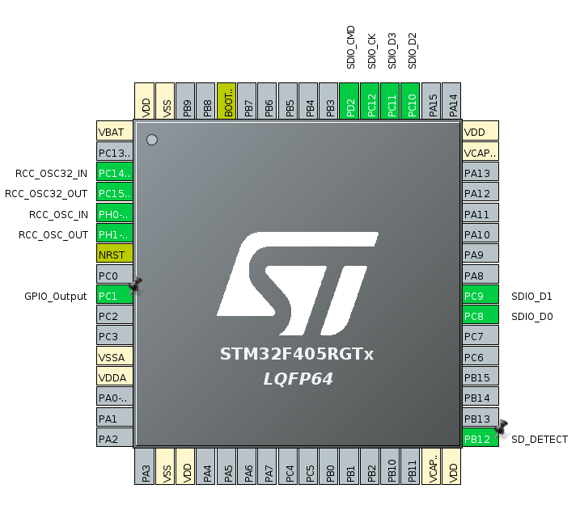

# STM32 CubeMX Tutorial by Chengming Zhang

PLEASE DO NOT SHARE OUTSIDE OF THE CLUB

## SD Card Write and Read Files

### CubeMX Setup



In the system Core menu, turn on the RCC clock for HSE and LSE by select the **Crystal/Ceramic Resonator**.

In the Pin Configuration, Click **PC1** to enable **GPIO_OUTPUT** for debugging purposes. If you do not know this already, PC1 is connected to the on board LED #13. **Click PB12 and select GPIO_INPUT**. You can right click on the pin to write your own label. In my case, I labeled it **SD_DETECT**. This pin is used to detect whether SD card is inserted or not.

In the Connectivity menu, turn on the SDIO by select the **SD 4 bit Wide bus Mode**. Verify the pin that is activated is the same as the one that was designed for in the original EAGLE file from your board manufacture.

Now, go to Middle-wares section and select **FATFS** (File Allocation Table File System).  In the mode section, select **SD Card**. In the FATFS menus, make sure **MAX_SS** is the max value you can pick. In Platform Setting, **select the Detect_SDIO option to PB12 which you just enabled.**


In the Clock Configuration Menu, use a **HCLK clock of 168 MHZ**, and make sure **48 MHZ clock is 48 MHZ**


In SDIO Configuration Parameter settings, change the value of **SDIO clock divide factor to 6**. This is to make sure the SD card interface is stable. In DMA Setting **turn on DMA request for RX and TX as following**


In the NVIC Settings of the SDIO, **enable the SDIO global interrupt**.


In the GPIO Setting of the SDIO, **enable PULL_UP on all port other than SDIO_CK**


Now open the Project Manager tab -> Code Generator and turn on the **Generate peripheral initialization as a pair of  '.c/.h' files per peripheral**

Now, before your continue, verify you have turn on all the setting above accurately. **IF ANY OF THE SETTING IS NOT SET CORRECTLY, IT WILL NOT WORK!** 

Now click the **Device Configuration Generation Tool** Button to generate the code


### Source Code for SD card Write File

```c
//Priviate Variables, add it to the appropriate location
FATFS myFatFS;
FIL myFile;
UINT myUnusedBytes;

// ------------ PLACE IN YOUR MAIN FUNCTION ------------
FRESULT status = f_mount(&myFatFS, SDPath, 1); //Mount SD card. Like any other file system
if(status == FR_OK) { //If the status is not FR_OK, get help from the internet.
    HAL_GPIO_WritePin(GPIOC, GPIO_PIN_1, GPIO_PIN_SET); //Turn on Debug Light
    HAL_Delay(1000);

    char myFileName[] = "TEST2.txt";
    if (f_open(&myFile, myFileName, FA_WRITE | FA_CREATE_ALWAYS) == FR_OK){ //fopen like C
        //BLINK SLOW on Debug Light
        HAL_GPIO_WritePin(GPIOC, GPIO_PIN_1, GPIO_PIN_RESET);
        HAL_Delay(1000);
        HAL_GPIO_WritePin(GPIOC, GPIO_PIN_1, GPIO_PIN_SET);
        HAL_Delay(1000);

        //data buffer to be written 
        char myData[] = "Hello, this is a test for sd card write. Purdue Robomaster Club";
        
        //fwrite like c
        if (f_write(&myFile, myData, sizeof(myData), &myUnusedBytes) == FR_OK){ 
            //BLINK FAST on Debug Light
            HAL_GPIO_WritePin(GPIOC, GPIO_PIN_1, GPIO_PIN_RESET);
            HAL_Delay(500);
            HAL_GPIO_WritePin(GPIOC, GPIO_PIN_1, GPIO_PIN_SET);
        }
        f_close(&myFile); //like fclose in C
    }

}else{
    HAL_GPIO_WritePin(GPIOC, GPIO_PIN_1, GPIO_PIN_RESET); //not light up the debug light
}

```

